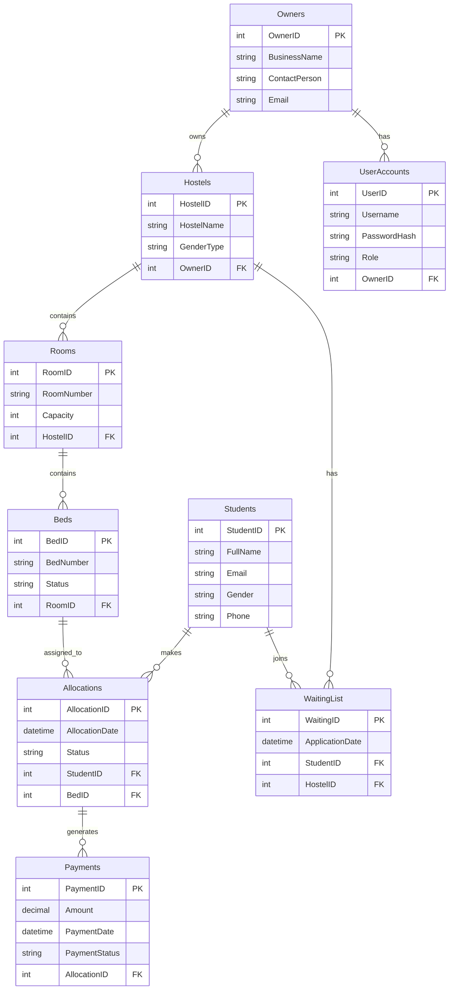

```mermaid
erDiagram
    Owners ||--o{ Hostels : "owns"
    Owners ||--o{ UserAccounts : "has"
    UserAccounts {
        int UserID PK
        string Username
        string PasswordHash
        string Role
        int OwnerID FK
    }
    Owners {
        int OwnerID PK
        string BusinessName
        string ContactPerson
        string Email
    }
    Hostels ||--o{ Rooms : "contains"
    Hostels ||--o{ WaitingList : "has"
    Hostels {
        int HostelID PK
        string HostelName
        string GenderType
        int OwnerID FK
    }
    Rooms ||--o{ Beds : "contains"
    Rooms {
        int RoomID PK
        string RoomNumber
        int Capacity
        int HostelID FK
    }
    Beds ||--o{ Allocations : "assigned_to"
    Beds {
        int BedID PK
        string BedNumber
        string Status
        int RoomID FK
    }
    Students ||--o{ Allocations : "makes"
    Students ||--o{ WaitingList : "joins"
    Students {
        int StudentID PK
        string FullName
        string Email
        string Gender
        string Phone
    }
    Allocations ||--o{ Payments : "generates"
    Allocations {
        int AllocationID PK
        datetime AllocationDate
        string Status
        int StudentID FK
        int BedID FK
    }
    Payments {
        int PaymentID PK
        decimal Amount
        datetime PaymentDate
        string PaymentStatus
        int AllocationID FK
    }
    WaitingList {
        int WaitingID PK
        datetime ApplicationDate
        int StudentID FK
        int HostelID FK
    }
```
